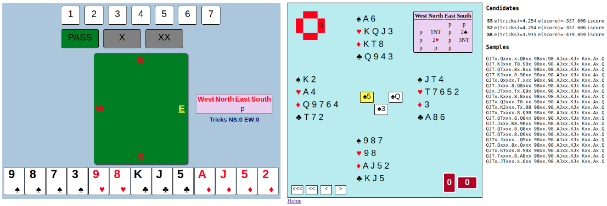

# Bridge Engine

This is a game engine for [bridge](https://en.wikipedia.org/wiki/Contract_bridge).
It can be used as a robot player, to do analysis, or to develop AI for bridge.

The engine is built using machine learning (neural networks) and [double dummy solver](https://github.com/dds-bridge/dds) through the python wrapper [python-dds](https://github.com/Afwas/python-dds).

To get a first impression of how the engine plays, please take a look at the [demo](https://lorserker.github.io/ben/demo/demo.html), or watch the bridge streamer Peter Hollands [demo the robot](https://www.youtube.com/watch?v=onG_V7vwxUk&t=150s) on IntoBridge.

For a few examples of how you can use the engine for analysis or development, see the [tutorials](#tutorials).

If you like the software, please consider making a donation to support the developers.

[](https://www.paypal.com/donate/?business=Z7G6CCTFK2XXS&no_recurring=0&currency_code=EUR)

## Getting Started

### Installation

The engine runs on Python 3.9, with the neural networks using tensorflow 2.0+

The recommended way of installing is in a [conda environment](https://docs.conda.io/en/latest/miniconda.html), but the current version can be run using Python 3.11 and Tensorflow 2.13 without any virtual environment.

For __Windows__ users: After installing anaconda, you  will have a new application called "Anaconda Prompt". Henceforth, you will have to run all commands in "Anaconda Prompt" not in "cmd". The title bar of your command prompt window should read *"Administrator: Anaconda Prompt (Miniconda3)"*

After installing conda, execute the commands in the [conda_setup.sh](conda_setup.sh) script to create an environment and install the dependencies.

The bridge engine was developed on Linux. It will likely work on any other platform which runs Python, but was only tested on Windows 10 and Windows 11 and Mac M1/M2.

For __Mac M1/M2__ users: you need to install [Homebrew](https://brew.sh/) if you don't have it already. Then, you need to `brew install boost`. You might need to open `./bin/darwin/libdds.so` in XCode before launching `ben` for the first time.

On __Amazon__, there is an image Public_Ben_Bot_V1.2 for starting an instance of BEN. After starting the instance just log in and execute [start_ben_bot_screens.sh].

For __Ubuntu__ users: You might have to compile libdds.so and might have to install libboost using `sudo apt install libboost-thread-dev` 

### Running the Web App

The engine has a (very basic) UI which enables you to play as a human agains three bots and then review the games you played.

The app runs in the browser, and the service has two components: (1) "appserver" which serves the UI through http, and (2) "gameserver" which serves the API to interface with the bots through websockets.

Following are instructions to start the service:

First, make sure that you are located in the `src` directory

```bash
cd src
```

Activate the conda environment

(If you are on __Windows__, make sure that you are in the *"Anaconda Prompt"*, not in the default Windows command prompt)

```bash
conda activate ben
```

Start the game server

(If you are on __Windows__ you  can omit `sudo` from the following commands)

```bash
python gameserver.py
```
By default you will just get random boards, but you can start the server with a parameter, and read boards from a file:

```bash
python gameserver.py --boards file.pbn
```
Only pbn and BEN's own internal format is supported (See input.ben)
adding --boardno will start from that number in the file.

And start the app server

```bash
python appserver.py
```

Now you can use the browser to navigate to `http://127.0.0.1:8080/home`
There will be a link "Play now". If you click that, a new board will be started and you can start playing bridge (you are South).
After playing a hand, a link to an analysis page will appear on the home page. The UI was tested on Firefox, Chrome and Android.



#### Running the Web App using container (Linux & Windows WSL2 ...)

It could be tricky to setup them all correctly in your environment, container env (like `docker`, `podman`) is another choice. 

`ghcr.io/lorserker/ben` [container package](https://github.com/lorserker/ben/pkgs/container/ben) is auto generated for each release. Inside it will execute the [start_ben_all.sh](start_ben_all.sh) to start above scripts automatically.

````
$ podman run --rm -it -p 8080:8080 -p 4443:4443 ghcr.io/lorserker/ben  # <CTRL-C> to stop
Reading deals from: /app/src/gamedb
Bottle v0.12.25 server starting up (using GeventServer())...
Listening on http://0.0.0.0:8080/
Hit Ctrl-C to quit.
...
Playing random deals or deals from the client
models loaded
Listening on port:  4443
````

Open browser to access http://localhost:8080 to play. 

You can build it locally like below to test local changes. New Mac is ARM based (not x86), you need to build locally as well.

````
$ podman build -t ben .
$ podman run --rm -it -p 8080:8080 -p 4443:4443 ben
````

If you want to debug in container env, then you need to map code repo into it, `-v $PWD:/app`.

### Tutorials

The tutorials serve as illustration of the engine's API and functionality, and should be helpful as a starting point if you would like to use the engine in a more customized way for analysis or for development.

The examples run in jupyter notebooks, but it's also possible to just read them without installing anything.

- __[Bidding](src/examples/Bidding.ipynb)__ shows how you can use the engine to bid hands and to sample hands which are consistent with a given auction
- __[Opening Leads](src/examples/OpeningLead.ipynb)__ illustrates how the engine "decides" which card to lead
- __[Card-by-card Analysis](src/examples/CardByCardAnalysis.ipynb)__ this example shows how the engine can go through an already played hand, analyse every bid made and every card played, and find possible mistakes. You can also give it a hand you played on BBO to see what the engine "thinks" about your play
- __[Single Dummy Estimates](src/examples/SingleDummyEstimates.ipynb)__ this exemplifies the use of a neural network to predict how many tricks declarer will take in a given contract on a given opening lead. As opposed to double dummy solvers, the results are approximate, but much faster.

## Play against itself and against other bots

To make the engine play against itself, execute this command:

```bash
sudo python game.py
```

After each board, it's possible to go through the play using the web UI.

You can send a PBN-file as parameter, when starting the game.

To make the engine play against other bots:

First run the [bridge monitor](http://www.wbridge5.com/bm.htm) table manager server.

Then, run the command below to connect to the table manager using the [blue chip bridge protocol version 18](https://web.archive.org/web/20210514012054/http://www.bluechipbridge.co.uk/protocol.htm)

```
python table_manager_client.py --host 127.0.0.1 --port 2000 --name BEN --seat North
```

that will connect to the table as North - the other seats can be taken similarly.

## What the engine cannot do (yet)

Below is a list of features which aren't implemented in this engine yet, but you would probably expect them from a bridge robot:

- can't play any other system except 2/1 (see [convention card](convention_card.md))
- can't configure the bidding system and the conventions (it just plays what it plays and assumes the opponents play that as well)
- can't alert
- can't explain bids or understand explanations of bids
- can't use or interpret defensive signals
- can't claim or accept claims
- it does reach good slams, but slam auctions are a bit weird
- isn't deployed as a service which you could play with on the internet (you have to install it to use it)

## Articles

- [Free and Open Source Bridge AI Engine Released](https://bridgewinners.com/article/view/free-and-open-source-bridge-ai-engine-released/)
- [Bridge AI: How Neural Networks Learn to Bid](https://bridgewinners.com/article/view/bridge-ai-how-neural-networks-learn-to-bid/)
- [Play with Ben on IntoBridge](https://intobridge.com/news/play-with-robots-on-intobridge/)
- [Meet Ben, a Bridge AI with a Difference](https://greatbridgelinks.com/meet-ben-a-bridge-ai-with-a-difference/)

## How to cite

```
@misc{Dali2022,
  author = {Dali, Lorand},
  title = {Bridge Engine},
  year = {2022},
  publisher = {GitHub},
  journal = {GitHub repository},
  howpublished = {\url{https://github.com/lorserker/ben}},
}
```

On Mac i use python3 and pip3