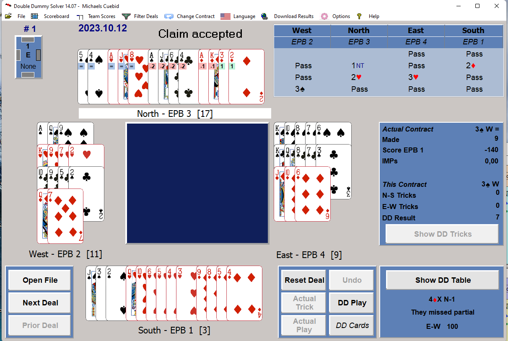
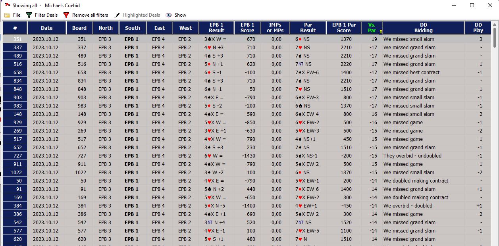

# Unofficial Computer Bridge Championship 2024

BEN is going to participate in UCBC 2024, and the content of this folder is to be used for training to the championship.

The official site for the championship can be found at: [https://robot-bridge.co.uk/2024-championships]

From the condition of contest: 

- For 2024 All bridge robots authors will use their preferred bidding system and conventions. The robot authors will have to be aware of systems and conventions used by the opposing bot.
- Due to the robots needing to understand the bidding and conventions of the opponent robot. The bridge robots can use their preferred bidding system and conventions, providing that the opposing robot has the system or conventions in their setup.  This should be determined before the event starts.Table Manager alerts will be used by the Table Manager Controller to avoid bidding misunderstanding, which have to be picked up by sight otherwise. The systems and conventions used must comply with the ACBL list used at the World Computer Bridge Championships: [http://www.allevybridge.com/allevy/computerbridge/WCBC_coc.html]

This will be a challenge for BEN as the current implementation is assuming NS and EW is playing the same system.

We do not have access to all the participating robots, and currently we do not know, the system preferred by the different robots, so I have made the following strategy:

- We will use Bridge Bidding Analyser to generate the bidding, and train BEN using the bidding from BBA.

But to make it more plug-and play we need to generate "interesting hands", where the different conventions are used instead of just random hands. 

We will try to set up BBA matching the opponent and how BEN will play against that opponent, so we can get training data for that specific opponent.

Currently I have selected this configuration for BEN, but it might change

        "1m opening allows 5M" (Current implementation needs rework)
        "1M-3M inviting" (Under inspection as we want 4-card support)
        "5431 convention after 1NT" (Might be dropped)
        "5NT pick a slam"
        "Blackwood 1430"
        "Checkback"
        "Cue bid"
        "Drury"
        "Exclusion"
        "Fit showing jumps"
        "Fourth suit"
        "Gerber"
        "Inverted minors"
        "Jacoby 2NT"
        "Jordan Truscott 2NT"
        "Lebensohl after 1NT"
        "Lebensohl after double"
        "Maximal Doubles"
        "Michaels Cuebid"
        "Minor Suit Stayman after 1NT"
        "Minor Suit Stayman after 2NT"
        "Mixed raise"
        "Multi-Landy"
        "Ogust"
        "Quantitative 4NT"
        "Responsive double"
        "ROPI DOPI"
        "SMOLEN"
        "Soloway Jump Shifts"
        "Splinter"
        "Support double redouble"
        "Two suit takeout double"
        "Two way game tries"
        "Unusual 1NT"
        "Unusual 2NT"
        "Unusual 4NT"
        "Weak natural 2D"
        "Weak natural 2M"

The convention card to load into BBA is located in [BBA Convention Cards](BBA%20convention%20cards/BEN-UCBC.bbsa)

The boards to be used for training is located in [Boards](Boards/)

We will try to generate at least 100 boards and possibly more for each convention/agreement used. The main strategy is to have as many boards with correct bidding as possible, and not just as many boards as possible, so quality over quantity.

After bidding all the boards against an oppponent we will have a PBN-file containing both open and closed room for the boards. BBA is using single dummy analysis to decide the result of each board, and will give some stats, that can be used to see if the convention is good or bad.

But we will use another approach, as we load the PBN-file into Double Dummy Solver 14 and compare the result with the with the double dummy result. With a high number of deals it is difficult to check all, so apply a filter looking at number of imps lost can show deals, where there might be problems

So here are some interesting boards to look at.

Now the strategy is to correct obvious errors in BBA, and Edward Piwowar is doing a great job. But remember it doesn't have to be perfect, we just need to be sure it looks right.

We can decide to delete boards with bad results, and it is not possible to change the bidding, so BEN don't have to learn bad bids.

So as a result of this we should have at least 100-200.000 boards, where the bidding is ok stored in some .pbn-files.

So now we use 
__[Pbn2Ben](src/Pbn2Ben.py)__ 
to translate the files into the format BEN is using for training.

From here we will follow the normal procedures for training BEN, but be aware, that when we train BEN we need to define the opponents system.

TBD

# Opening lead
TBD

# Declarer play
TBD

# Defensive play
TBD